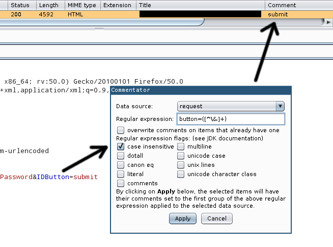

Comment generator plugin for Burp Suite
=======================================

Generates comments for selected request(s) based on regular expressions.

Usage
-----

Select one or more HTTP messages (for example items in the top half of the
`HTTP history` tab within `Proxy`. Click with the right mouse button to open the
popup menu, and select `Generate comment field...`.

A window appears with several options:

 - A regular expression can be entered in the text field, the first group
   will become the comment on the selected items.
 - The dropdown list on the top of the window determines which input the
   regular expression is evaluated on; request or response.
 - Items that already have comments can be ignored or overwritten, depending
   on a checkbox.
 - The behavior of the regular expression engine can be fine tuned with the
   flags that Java provides (see below).

As it can be seen on the example in the screenshot above the list, the
regular expression uses the first (number 1) group after evaluation, so the
expression must contain at least one group (delimited by parentheses).
In regex, the 0th (also considered first by programmers) group contains the
whole expression, hence the above clarification regarding our use of the
first group, which is number 1, not 0.

The built-in regular expression engine of the Java runtime is used, their
interpretation of the standard, including character classes and flags can
be found in [the JDK documentation of java.util.regex.Pattern][1].

Known issues
------------

At least on Linux / OpenJDK hosts, the newly set messages [don't get updated
automatically][2], in these cases forcing a redraw manually (by clicking,
scrolling, changing tabs, etc.) might be necessary.

Building
--------

 - (For testing) install JUnit, put the JARs into `lib`
 - Execute `ant`, and you'll have the plugin ready in `burp-commentator.jar`

Dependencies
------------

 - JDK 1.6+ (tested on OpenJDK `1.8.0_111`, Debian/Ubuntu package: `openjdk-8-jdk`)
 - Apache ANT (Debian/Ubuntu package: `ant`)
 - JUnit 4+ (only required for testing)

License
-------

The whole project is available under MIT license, see `LICENSE.txt`.

  [1]: https://docs.oracle.com/javase/8/docs/api/java/util/regex/Pattern.html
  [2]: https://support.portswigger.net/customer/en/portal/questions/16796165-ihttprequestresponse-setmessage-does-not-update-proxy-history-automatically
